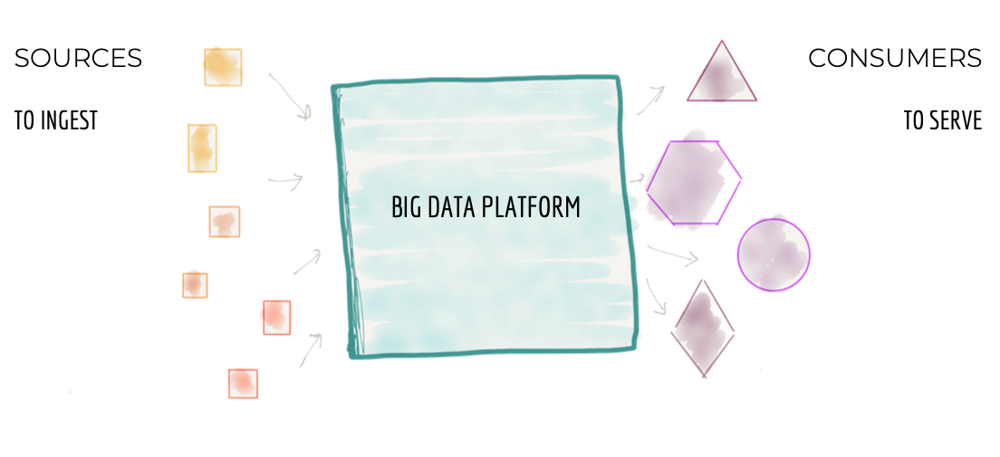
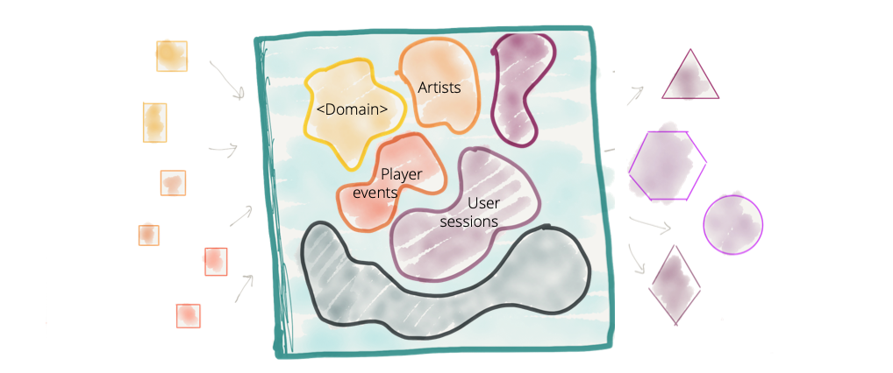
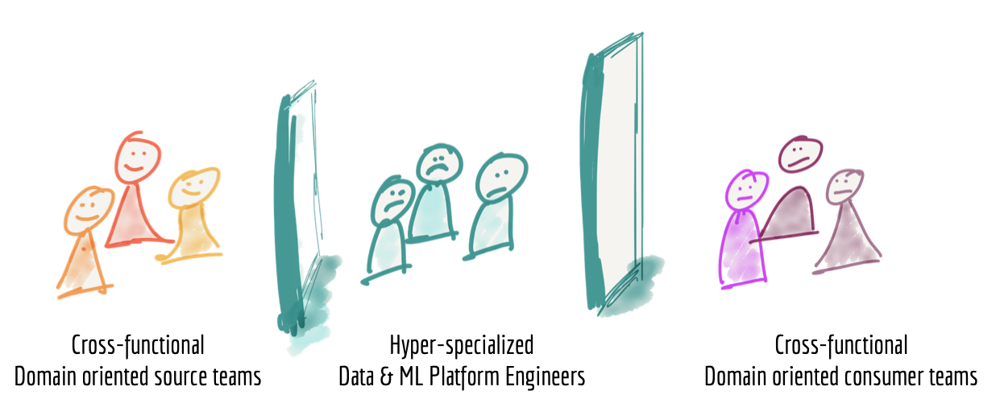
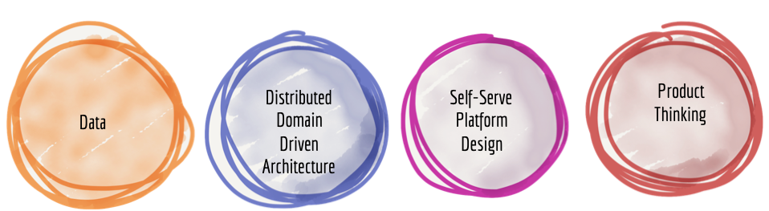
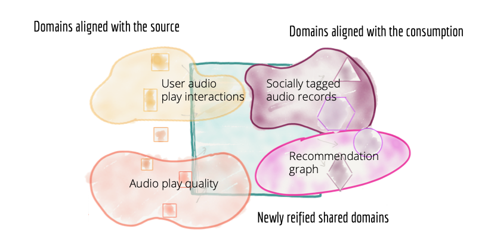

---
title: 分布式数据网格 Data Mesh（draft）
tags: 技术 大数据 "Data Mesh"
--- 

ThoughtWorks最近一期的[技术雷达](https://www.thoughtworks.com/cn/radar/techniques/data-mesh)，把Data Mesh从“评估”调升到了“试验”。ThoughtWorks眼中的“试验”意味着这项技术“值得追求。重要的是理解如何建立这种能力。企业应该在风险可控的项目中尝试此技术。”

文章内容大部分来自 Zhamak Dehghani 的[《How to Move Beyond a Monolithic Data Lake to a Distributed Data Mesh》](https://martinfowler.com/articles/data-monolith-to-mesh.html) 讲了如何将单体的数据湖，变为分布式的数据网格（Data Mesh）。

那么，未来的企业数据中心，可能企业将告别建造单体的数据湖，转而成为分布式的数据水系么？

<!--more-->

# 如何从单体数据湖演进到分布式数据网格

许多企业都在投资建设自己的下一代数据湖，希望通过数据洞察业务并做出智能决策。基于数据湖的数据平台架构，这样的单体架构存在共通的失败特征，不能达到建设时承诺过的服务标准。为了解决这些问题，我们需要转变这种集中式的数据湖或者数仓。我们需要一种现代的分布式架构：将“领域”作为首要考虑的因素，运用平台化的思维创建自助服务型的数据基础设施，并且将数据也视作一种产品。

建设数据驱动的组织，是当前许多公司的首要目标。他们深知数据智为企业带来的好处：基于数据与个性化技术，提升的客户体验；数据驱动的运营成本优化；通过趋势分析和BI工具为员工赋能。他们也一直在大力投资构建数据和智能平台。然而构建数据平台虽然投入不菲，但是最后结果却一般般。

我承认组织在转型数据驱动时，会面临诸多复杂问题：比如需要迁移十几年前的历史遗留系统，企业之前的内部文化并不欢迎数据加入，以及难以权衡的业务优先级。我所分享的架构理念，正是基于这诸多失败的数据平台建造过程，借鉴过去十年间在建造分布式架构，引入“数据领域”，这项新的企业数据架构，我称之为——数据网格（Data Mesh）。

在继续阅读之前，请各位读者放下对传统数据平台架构建设理念的固有思维，尽可能地以开放的心态拥抱分布式数据网格架构。你需要面对这样一个事实：数据是永远存在的、是无处不在的、而且是分布式存在的。

## 当前企业数据平台架构及其弊端

It is centralized, monolithic and domain agnostic aka data lake.
当前企业的数据平台是：中心化、整体化、领域无关的，亦称数据湖。

Almost every client I work with is either planning or building their 3rd generation data and intelligence platform, while admitting the failures of the past generations:
我接触过的所有客户，都正在构建或者计划构建他们的第三代数据智能平台，同时也认识到之前两代数据平台的不足：

*  第一代： 专有的企业数据仓库和BI平台；虽然这是一个价格不菲的解决方案，但同样留下了不小的技术债务；技术债务存在于数千个难以维护的ETL作业，诸多表格和报告中，这些东西仅有少数专业人员能够理解他们。

*  第二代： 大数据生态构建的数据湖，看起来似乎是银弹。复杂的大数据生态系统，长时间执行的批处理作业，必须由高度专业化的工程小组构建和维护，他们创造的是一个数据湖怪兽，但是充其量也只能完成一些研发分析；对比建设初期许下的承诺，显然有些差距。

The third and current generation data platforms are more or less similar to the previous generation, with a modern twist towards (a) streaming for real-time data availability with architectures such as Kappa, (b) unifying the batch and stream processing for data transformation with frameworks such as Apache Beam, as well as (c) fully embracing cloud based managed services for storage, data pipeline execution engines and machine learning platforms. It is evident that the third generation data platform is addressing some of the gaps of the previous generations such as real-time data analytics, as well as reducing the cost of managing big data infrastructure. However it suffers from many of the underlying characteristics that led to the failures of the previous generations.

第三代数据平台和当前的架构或多或少有些类似，面向流的实时数据处理架构，比如Kappa； 批流一体的数据转换框架，比如Apache Beam；以及完全基于云的托管服务来存储、处理数据的流水线和机器学习平台。显而易见，第三代数据平台正在解决之前遇到的问题，比如实时数据处理，以及降低基础设施的管理成本。但是，这种架构依然面临着和之前两代一样的潜在弊端。

### 架构弊端

为了解释这些数据平台面临的潜在问题，我们看一下这些架构的特征。在本文中，以互联网流媒体业务为例（像Spotify，SoundCloud，Apple iTunes等）来阐明一些概念。

#### 集中式和单体式

从三万英尺的高度看数据平台架构，就像下面图1所示。集中式的目标是：

* 从企业的各个角落获取数据，包括运营系统、交易系统等等，也包括外部数据供应商。例如在流媒体业务中，数据平台会负责获取各种数据：“媒体播放器的性能”、“用户和播放器的交互”、“播放列表”、“关注的歌手”、“唱片公司和歌手”、和歌手之间的“金融结算”，以及外部市场调研数据（比如客户人口统计信息）等等。

* 清洗，扩表，转换源数据到高质量数据，以满足数据消费端的需求。在我们的示例中，用户交互行为的点击流信息，扩充上用户的详细信息，这种转换将重建用户的行为到一个聚合视图中。

* 向不同的数据需求方提供数据，需要提供不同种类的数据。从数据中分析消费，通过机器学习制定决策，通过BI报表展示业务表现，这些需求所需要的数据各不相同。在我们的流媒体示例中，平台可以近实时的从Kafka等分布式日志系统接口中取得全球范围内播放器的错误和播放质量信息，或者提供某个歌手的播放记录的聚合视图，以推动财务结算应付账款给歌手和唱片公司。

图1：三万英尺俯瞰单体数据平台

单体架构平台上的集中托管的数据，在逻辑上其实并不属于相同的领域，比如：“播放事件”、“销售的KPI”、“歌手”、“唱片”、“唱片公司”、“音频”、“播客”、“音乐活动”等等；这些数据来自大量不同领域。

过去十年间，尽管我们成功地将领域驱动设计（Domain Driven Design,DDD）和边界上下文（Bounded Context）应用于各类系统，但是我们在数据平台中却忽略了领域的概念。我们已经不知不觉地从“面向领域的数据所有权”转向了“集中式领域不明确的数据所有权”。我们以创造最大的单体大数据平台而骄傲。

图2： 集中数据平台，没有明确的数据领域边界和面向领域数据的所有权。

集中式的模型适用于较为简单的领域，数据消费端数量较少的情况；对于领域丰富，数据生产来源众多，数据消费者多样的企业并不适用。

集中式的数据平台架构通常有两个压力点，经常导致数据平台是建设失败：

* 分散的数据和源的不断增加：随着数据变得分散，单一平台的控制协调能力将会下降。想象一下，“客户信息”，在组织内外有各种各样的数据来源，提供现存和潜在客户的信息。随着数据源的不断增加，我们需要从各个数据源接入并存储到一个单一的位置。对于数据用途，数据科学家和分析师希望低成本的处理各个数据集，以运营为目的使用数据，和以分析目的使用数据的方式也并不相同。我的看法是，现有的集中式的解决方案，不是应对多领域，数据源持续新增的大企业的最佳解决方案。

* 业务创新需求和数据消费多元化：业务方通常需要通过数据快速验证一些想法，这样的需求引入了大量的数据使用的案例。这意味着不同的数据处理任务数量也不断增长：聚合、投影、切片，以满足创新的测试和学习。长期以来，如何快速满足数据使用者的需求，一直是企业面临的问题，并且在现代数据平台架构中依然如此。

但是需要澄清的是，我并不是要鼓吹之前那种隐藏在各个系统中的、分散、孤立、烟筒似的领域数据，这样的数据是难以被发现、理解和使用的。也不是鼓吹那些由于多年攒下的技术债务导致的分散成的多个数据孤岛。我的观点是，为了解决这些无法访问的数据孤岛问题，不应该是建立一个集中的数据平台，再搭上一个中心化的团队。这样就会面临我们前面提到的那些扩展性的问题。

#### 耦合数据流水线的拆分方式

传统数据平台架构的第二弊端是我们如何拆分体系结构。在一万英尺看集中式大数据平台的时候，我们会发现数据架构依据获取、清洗、聚合、服务等功能进行拆分。架构师会根据平台的增长进一步分解体系架构。架构师需要找到一个扩展系统，将其分解到架构单元（architectural quantum）。在《演进式构建》的描述中，一个“架构单元”是一个具备完整功能、高内聚、可独立部署的组件。将系统分解为单一结构单元的初衷，是方便划分独立的团队，每个人都可以构建和维护这个结构单元。团队之间并行工作以便增加系统的可扩展性和建设速度。

考虑到前几代数据平台架构的影响，架构师通常将数据平台划分为一系列的数据处理阶段。围绕数据处理的技术实现，通过一条流水线实现一组功能。包括了数据获取、预处理、聚合、服务等功能。

图3：数据平台的架构拆分方式

尽管此模型可以提供一定程度的扩展，但是将团队分配到数据流水线上的不同阶段，具有一个固有的局限性，将功能交付速度拖慢。整条数据流水线在各个阶段都具有很高的耦合性，而这种拆分方式，流水线的拆分方向和流水线本身的变化方向，刚好是正交的。

让我们看一下流媒体实例。互联网流媒体平台围绕他们的媒体类型，具有强大的面向领域建造能力。这些服务通常以“歌曲”和“专辑”开始，然后再扩展到“音乐活动”、“播客”、“电台SHOW”、“电影”等等。每一个数据统计的新需求，例如“播客播放率”，需要修改整个数据流水线上的所有部分。团队必须引入新的获取数据的代码、新的清理数据和预处理数据的代码、新的聚合数据的代码，直到最后才是展示“播客播放率”的视图。这要求在不同的组件之间要同步实现功能，并在团队之间管理发布节奏。许多数据平台现在已经提供了通用的和基于配置的数据获取服务，以应对扩展的需求，降低实现新功能的成本。但是这并没有从根本上消除新数据集需要端到端的依赖性管理。流水线架构从表面上看，各个处理阶段已经是一个独立的架构单元，但是从整个单体平台角度看，这整条数据流水线才是最小的架构单元，新的数据集从获取到展示，必须要改变整条流水线。这就限制了我们快速应对新的数据源或者新的数据使用需求。

图4：新增或改进功能时，架构的分解和对应的变化是正交的，从而导致耦合并且拖慢了交付。

#### 专业且独立的技术团队

当前数据平台的第三个弊端，与我们如何建立平台团队有关系。当我们更近距离观察这些构建和维护数据平台的工程师们，会发现他们是一群超专业的工程师，和那些生产数据或者使用数据的部门是隔离开的。数据平台工程师通常不仅组织结构上的独立，而且通常他们具备大数据工具的专业经验，且缺乏业务相关领域的知识，因而被组成一个独立的团队。

图5：专业且独立的数据平台团队

我个人并不羡慕平台工程师的工作。一方面，他们需要从其他团队消费数据，但是其他团队并没有动力提供那么真实、准确、有意义的数据。而另一方面，他们对生产数据的领域又知之甚少，缺乏专业知识。他们需要为各需求方提供数据，却不了解数据需求方的领域知识。

在流媒体平台这个例子中，在数据源一侧，我们有跨职能的“播放器”团队，可以提供用户如何使用播放器功能的有效信息，比如“播放乐曲事件”、“购买事件”、“播放的音频质量”等等；在数据的另一端，是跨职能的数据消费团队，例如“歌曲推荐团队”推荐歌曲，“销售团队”报告销售KPI，“结算团队”通过计算播放事件数量支付给歌手费用等等。不幸的是，加载中间的数据平台团队，需要付诸全力才能为生产端和消费端提供合适的数据。

但实际上，我们发现数据平台团队，很难获得数据生产端的支持，又很容易被数据消费端争抢任务排期，这导致数据平台团队一直被撕扯。

我们当前创建的技术架构和组织结构都无法进行扩展，自然不能实现在创建数据驱动型组织时设立的目标。

## 下一代企业数据平台架构

使用分布式数据网格（Data Mesh）拥抱无处不在的数据。

针对上面讨论的集中式架构的弊端，我们的应对是什么？我认为是进行必要的范式转换（paradigm shift）。在构建大规模分布式体系架构中已经有所应用，并且在业界已经取得了不错的成果。

I suggest that the next enterprise data platform architecture is in the convergence of Distributed Domain Driven Architecture, Self-serve Platform Design, and Product Thinking with Data.
我建议下一代企业数据平台架构，包括：分布式领域驱动架构（Distributed Domain Driven Architecture），自助服务平台设计（Self-serve Platform Design），以及数据产品思想（Product Thinking with Data）

图6：转变范式，构建下一代数据平台

尽管听起来有很多时髦的词，但这些技术在特定领域已经产生了重大的积极影响。让我们深入研究如何将这些技术应用于数据领域，以摆脱多年来陈旧的数仓体系结构。

### 数据 与 分布式领域驱动架构相结合

#### 面向领域的数据的拆分

埃里克·埃文斯（Eric Evans）的著作《域驱动设计》（Domain-Driven Design）深刻地影响了现代体系架构思想，也影响了组织架构模型。它通过将系统分解为：围绕业务域构建分布式服务的微服务体系结构。从根本上改变了团队的组成方式，从而使团队可以独立自主地拥有特定领域的能力。

尽管在许多时候，我们都采用了面向领域的拆分方式，但奇怪的是，在涉及数据时，我们却忽略了业务领域的概念。在数据平台体系结构中最接近DDD概念的地方，是数据源端的系统生产的业务领域的事件，然后由数据平台来接收它们。但是，在此之后，数据就失去了领域的概念，该领域团队也失去了对数据的掌控。

领域边界上下文是划分数据集归属的有力工具。Ben Stopford的《Data Dichotomy》一文介绍了通过流共享领域数据集的概念。

为了数据平台的去中心化，我们需要反思我们的数据，反思数据所处的位置和责任归属。不应将数据从特定领域全部归集到数据湖或平台，而是应该由数据所归属的“领域”以方便消费的方式保存他们的数据并提供数据服务。

在我们的例子中，与其让数据里从媒体播放器流入中心数据平台，不如思考让“播放器域”自己掌握所有数据并提供服务，其他下游团队进行访问。数据集存储在哪里，如何流动，这是“播放器域”自己的技术实现。物理存储可以是Amazon S3这样的基础架构，但是数据的内容和归属依然属于生产它的团队。类似的，“推荐域”通过创建适合他们自己业务的数据格式，比如通过消费“播放器域”的数据，经过处理和计算，保存到图数据库存储。如果其他领域，例如“发现新歌手域”发现“推荐域”中图数据有意义，他们就可以选择拉取这些数据。

这意味着，我们可能需要复制数据，然后做一些计算变成新的领域数据。例如，将时间序列的播放事件，转换为歌手相关的图。

我们需要转变思维方式，从推送和获取（传统的通过ETL和事件流处理数据的方式），转换到跨领域的服务和拉取模型。

在面向领域数据平台中基本的架构单元是“领域”，而不是数据流水线上的不同处理阶段。

图7：根据领域划分数据架构和团队。

#### 面向源的领域数据  Source oriented domain data

Some domains naturally align with the source, where the data originates. The source domain datasets represent the facts and reality of the business. The source domain datasets capture the data that is mapped very closely to what the operational systems of their origin, systems of reality, generate. In our example facts of the business such as 'how the users are interacting with the services', or 'the process of onboarding labels' lead to creation of domain datasets such as 'user click streams', 'audio play quality stream' and 'onboarded labels'. These facts are best known and generated by the operational systems that sit at the point of origin. For example the media player system knows best about the 'user click streams'.
一些领域和源数据的组成是天然一致的。源领域数据集，展示的是业务上的事实。原领域数据集对应是原始业务系统中的数据，代表实际的系统生成的数据。在我们的示例中，”用户如何使用服务“、”标记流程“这样的业务实际创建数据的数据，例如”用户点击流“、”音频播放质量流“、”标签“。这些是数据就是由原始业务系统生成的，媒体播放器最清楚”用户点击流“

In a mature and ideal situation, an operational system and it's team or organizational unit, are not only responsible for providing business capabilities but also responsible for providing the truths of their business domain as source domain datasets. At enterprise scale there is never a one to one mapping between a domain concept and a source system. There are often many systems that can serve parts of the data that belongs to a domain, some legacy and some easy to change. Hence there might be many source aligned datasets aka reality datasets that ultimately need to be aggregated to a cohesive domain aligned dataset.
在理想情况下，一个业务系统和它的业务团队，除了负责提供业务能力，也要提供他们领域的源数据集。在企业中，没有一对一的领域和源系统的对应关系。他们通常是许多系统，各自提供一部分数据属于同一个领域，有些事旧系统，有些易改动。因此这里由许多源数据集需要对齐（事实数据集），最终需要汇聚成为一个内聚的领域对齐的数据集。

The business facts are best presented as business Domain Events, can be stored and served as distributed logs of time-stamped events for any authorized consumer to access.
业务事实，最佳的表现形式是”业务领域事实“，存储带有时间戳的事件的分布式日志，供授权数据消费者访问。

In addition to timed events, source data domains should also provide easily consumable historical snapshots of the source domain datasets, aggregated over a time interval that closely reflects the interval of change for their domain. For example in an 'onboarded labels' source domain, which shows the labels of the artists that provide music to the streaming business, aggregating the onboarded labels on a monthly basis is a reasonable view to provide in addition to the events generated through the process of onboarding labels.
除了时序事件外，源数据域还应该提供源域数据集的易与消费使用的历史快照，这些快照在一定时间间隔内汇总，以紧密反映其领域的变化。例如，在“内嵌标签”源域中，该域显示了向流媒体业务提供音乐的艺术家的标签，每月汇总一种合理的视图。（此处翻译存疑）

Note that the source aligned domain datasets must be separated from the internal source systems' datasets. The nature of the domain datasets is very different from the internal data that the operational systems use to do their job. They have a much larger volume, represent immutable timed facts, and change less frequently than their systems. For this reason the actual underlying storage must be suitable for big data, and separate from the existing operational databases. Section Data and self-serve platform design convergence describes how to create big data storage and serving infrastructure.
注意，对齐后的源域数据集必须与内部源系统的数据集分开。领域数据集的性质与运营系统用来完成其工作的内部数据有很大不同。与它们的系统相比，它们具有更大的体积，代表不变的定时事实，并且更改频率较低。因此，实际的基础存储必须适合大数据，并且必须与现有的操作数据库分开。数据和自助服务平台的设计融合部分章节，介绍如何创建大数据存储和服务的基础设施。

Source domain datasets are the most foundational datasets and change less often, as the facts of business don't change that frequently. These domain datasets are expected to be permanently captured and made available, so that as the organization evolves its data-driven and intelligence services they can always go back to the business facts, and create new aggregations or projections.
源域数据集是最基础的数据集，并且更改频率较低，因为业务事实并不经常更改。预计这些域数据集将被永久捕获并变得可用，因此随着组织发展其数据驱动的和情报服务，他们可以始终追溯到业务事实，并创建新的汇总或预测。

Note that source domain datasets represent closely the raw data at the point of creation, and are not fitted or modeled for a particular consumer.
请注意，源域数据集在创建时几乎代表原始数据，并且未针对特定使用者进行拟合或建模。

#### 面向消费的共享领域数据 Consumer oriented and shared domain data

Some domains align closely with the consumption. The consumer domain datasets and the teams who own them, aim to satisfy a closely related group of use cases. For example the 'social recommendation domain' that focuses on providing recommendations based on users social connections to each other, create domain datasets that fit this specific need; perhaps through a 'graph representation of social network of users'. While this graph dataset is useful for recommendation use case, it might be also useful for a 'listeners notifications' domain, which provides data regarding different types of notifications that are sent to the listener, including what people in their social network are listening to. So it is possible that 'user social network' can become a shared and newly reified domain dataset for multiple consumers to use. The 'user social network' domain team focuses on providing an always curated and uptodate view of the 'user social network'.
一些领域与数据消费密切相关。数据消费端的领域数据集和其团队旨在满足一组密切相关的用例。例如，“社交推荐领域”侧重于根据用户之间的社交联系提供推荐，创建适合此特定需求的域数据集；也许通过“用户社交网络的图形表示”。虽然此图数据集对于推荐用例很有用，但对于“听众通知”领域也可能有用，该域提供有关发送给听众的不同类型的通知的数据，包括其社交网络中的人正在听的内容。因此，“用户社交网络”有可能成为共享的和新定义的领域数据集，供多个消费者使用。 “用户社交网络”域团队致力于提供“用户社交网络”的始终精选和最新视图。

The consumer aligned domain datasets have a different nature in comparison to source domains datasets. They structurally go through more changes, and they transform the source domain events to aggregate views and structures that fit a particular access model, such as the graph example we saw above. A domain oriented data platform should be able to easily regenerate these consumer datasets from the source.
消费者对齐的域数据集与源域数据集相比具有不同的性质。它们在结构上进行了更多更改，并且将源域事件转换为聚合适合特定访问模型的视图和结构，例如我们上面看到的图形示例。面向领域的数据平台应该能够轻松地从源头重新生成这些消费者数据集。

#### 分布式数据流水线作为领域内部实现 Distributed pipelines as domain internal implementation

While the datasets ownership is delegated from the central platform to the domains, the need for cleansing, preparing, aggregating and serving data remains, so does the usage of data pipeline. In this architecture, a data pipeline is simply an internal complexity and implementation of the data domain and is handled internally within the domain. As a result we will be seeing a distribution of the data pipelines stages into each domain.
尽管将数据集所有权从中央平台委派给域，但仍然需要清理，准备，聚合和提供数据，数据管道的使用也是如此。在这种体系结构中，数据管道只是内部复杂性和数据域的实现，并在该域内部进行处理。结果，我们将看到数据管道阶段分布到每个域中。

For example the source domains need to include the cleansing, deduplicating, enriching of their domain events so that they can be consumed by other domains, without replication of cleansing. Each domain dataset must establish a Service Level Objectives for the quality of the data it provides: timeliness, error rates, etc. For example our media player domain providing audio 'play clickstream' can include cleansing and standardizing data pipeline in their domain that provides a stream of de-duped near real-time 'play audio click events' that conform to the organization's standards of encoding events.
例如，源域需要包括对其域事件的清除，重复数据删除，扩展，以便其他域可以使用它们，而无需复制清除。每个域数据集都必须为其提供的数据质量建立 服务水平目标：及时性，错误率等。例如，我们提供音频“播放点击流”的媒体播放器域可以在其域中清理和标准化数据管道，从而提供重复数据消除的近实时“播放音频单击事件”，符合组织的编码事件标准。

Equally, we will see that aggregation stages of a centralized pipeline move into implementation details of consuming domains.
同样，我们将看到集中式管道的聚合阶段进入了使用域的实现细节。

图8：将管道分配到域中作为第二类关注点，以及域的内部实现细节 
Figure 8: Distribute the pipelines into the domains as a second class concern and the domain's internal implementation detail

One might argue that this model might lead to duplicated effort in each domain to create their own data processing pipeline implementation, technology stack and tooling. I will address this concern shortly as we talk about the Convergence of Data and Platform Thinking with Self-serve shared Data Infrastructure as a Platform.
有人可能会争辩说，该模型可能会导致每个领域在创建自己的数据处理管道实现，技术堆栈和工具方面做出重复的努力。我将在谈论 自助共享数据基础架构作为平台的数据和平台思维的融合时，很快就解决这个问题 。

### 数据和产品思维融合 Data and product thinking convergence

Distribution of the data ownership and data pipeline implementation into the hands of the business domains raise an important concern around accessibility, usability and harmonization of distributed datasets. This is where the learning in applying product thinking and ownership of data assets come handy.
将数据所有权和数据管道实现分配到业务领域之内引起了对分布式数据集的可访问性，可用性和协调性的重要关注。在这里，应用产品思想和数据资产所有权的学习 非常方便。

#### 域数据作为产品 Domain data as a product

Over the last decade operational domains have built product thinking into the capabilities they provide to the rest of the organization. Domain teams provide these capabilities as APIs to the rest of the developers in the organization, as building blocks of creating higher order value and functionality. The teams strive for creating the best developer experience for their domain APIs; including discoverable and understandable API documentation, API test sandboxes, and closely tracked quality and adoption KPIs.
在过去的十年中，运营领域已将 产品思想 融入到他们为组织其他部门提供的功能中。领域团队将这些功能作为API提供给组织中其他开发人员，作为创建更高订单价值和功能的基础。这些团队致力于为他们的域API创建最佳的开发人员体验；包括可发现且易于理解的API文档，API测试沙箱以及密切跟踪的质量和采用KPI。

For a distributed data platform to be successful, domain data teams must apply product thinking with similar rigor to the datasets that they provide; considering their data assets as their products and the rest of the organization's data scientists, ML and data engineers as their customers.
为了使分布式数据平台成功，领域数据团队必须对他们提供的数据集进行严格的产品思考。将数据资产视为产品，并将组织的其余数据科学家，机器学习和数据工程师视为客户。

图9：域数据集作为产品的特征
Figure 9: Characteristics of domain datasets as product

Consider our example, internet media streaming business. One of its critical domains is the 'play events', what songs have been played by whom, when and where. This key domain has different consumers in the organization; for example near real-time consumers that are interested in the experience of the user and possibly errors so that in case of a degraded customer experience or an incoming customer support call can respond quickly to recover the error. There are also a few consumers that would prefer the historical snapshots of the daily, or monthly song play event aggregates.
考虑我们的示例，互联网媒体流业务。它的关键领域之一是“播放事件”，即谁，何时，何地播放了哪些歌曲。这个关键领域在组织中有不同的使用者；例如，对用户体验以及可能的错误感兴趣的近实时消费者，以便在客户体验下降或客户支持电话打入的情况下可以快速响应以恢复错误。也有一些消费者更喜欢每日或每月歌曲播放事件汇总的历史快照。

In this case our 'played songs' domain provides two different datasets as its products to the rest of the organization; real-time play events exposed on event streams, and aggregated play events exposed as serialized files on an object store.
在这种情况下，我们的“播放的歌曲”域为组织的其他部分提供了两个不同的数据集作为产品。在事件流上公开的实时播放事件，以及在对象存储中公开为序列化文件的聚合播放事件。

An important quality of any technical product, in this case domain data products, is to delight their consumers; in this case data engineers, ml engineers or data scientists. To provide the best user experience for consumers, the domain data products need to have the following basic qualities:
任何技术产品（在这种情况下是领域数据产品）的一项重要素质就是使他们的消费者满意。在这种情况下，数据工程师，毫升工程师或数据科学家。为了向消费者提供最佳的用户体验，域数据产品需要具有以下基本素质：

##### 可发现  Discoverable

A data product must be easily discoverable. A common implementation is to have a registry, a data catalogue, of all available data products with their meta information such as their owners, source of origin, lineage, sample datasets, etc. This centralized discoverability service allows data consumers, engineers and scientists in an organization, to find a dataset of their interest easily. Each domain data product must register itself with this centralized data catalogue for easy discoverability.
数据产品必须易于发现。常见的实现方式是对所有可用数据产品及其元信息（例如其所有者，来源来源，血统，样本数据集等）进行注册，数据目录编制。该集中式可发现性服务允许数据消费者，工程师和科学家组织，以轻松找到他们感兴趣的数据集。每个域数据产品都必须在此集中式数据目录中注册以方便发现。

Note the perspective shift here is from a single platform extracting and owning the data for its use, to each domain providing its data as a product in a discoverable fashion.
请注意，这里的观点转变是从单个平台提取并拥有 供其使用的数据，到以可发现的方式将其数据作为产品提供的每个域。 

##### 可寻址的 Addressable

A data product, once discovered, should have a unique address following a global convention that helps its users to programmatically access it. The organizations may adopt different naming conventions for their data, depending on the underlying storage and format of the data. Considering the ease of use as an objective, in a decentralized architecture, it is necessary for common conventions to be developed. Different domains might store and serve their datasets in different formats, events might be stored and accessed through streams such as Kafka topics, columnar datasets might use CSV files, or AWS S3 buckets of serialized Parquet files. A standard for addressability of datasets in a polyglot environment removes friction when finding and accessing information.
数据产品一旦发现，应遵循全局约定，以帮助其用户以编程方式访问它的唯一地址。根据数据的基础存储和格式，组织可以为数据采用不同的命名约定。考虑到易用性，在一个分散的体系结构中，有必要制定通用的约定。不同的域可能以不同的格式存储和提供其数据集，事件可能通过诸如Kafka主题之类的流进行存储和访问，柱状数据集可能使用CSV文件或序列化Parquet的AWS S3存储桶文件。多种语言环境中的数据集可寻址性标准消除了查找和访问信息时的摩擦。

##### 诚实守信 Trustworthy and truthful

No one will use a product that they can't trust. In the traditional data platforms it's acceptable to extract and onboard data that has errors, does not reflect the truth of the business and simply can't be trusted. This is where the majority of the efforts of centralized data pipelines are concentrated, cleansing data after ingestion.
没有人会使用他们不信任的产品。在传统的数据平台中，可以提取并装载有错误，不能反映业务真相并且根本无法信任的数据。在这里，集中式数据管道的大部分工作都集中在此，在提取数据后清理数据。

A fundamental shift requires the owners of the data products to provide an acceptable Service Level Objective around the truthfulness of the data, and how closely it reflects the reality of the events that have occurred or the high probability of the truthfulness of the insights that have been generated. Applying data cleansing and automated data integrity testing at the point of creation of the data product are some of the techniques to be utilized to provide an acceptable level of quality. Providing data provenance and data lineage as the metadata associated with each data product helps consumers gain further confidence in the data product and its suitability for their particular needs.
根本性的转变要求数据产品的所有者围绕数据的真实性提供可接受的服务水平目标，以及它与事件发生的真实性或已发现的洞察的真实性的高可能性之间的接近程度。产生。在创建数据产品时应用数据清理和自动数据完整性测试是可用来提供可接受质量水平的一些技术。提供数据来源和数据沿袭 因为与每个数据产品相关的元数据有助于消费者进一步信任数据产品及其对特定需求的适用性。

The target value or range of a data integrity (quality) indicator vary between domain data products. For example, 'play event' domain may provide two different data products, one near-real-time with lower level of accuracy, including missing or duplicate events, and one with longer delay and higher level of events accuracy. Each data product defines and assure the target level of its integrity and truthfulness as a set of SLOs.
数据完整性（质量）指标的目标值或范围在域数据产品之间有所不同。例如，“播放事件”域可以提供两种不同的数据产品，一种接近实时，准确性较低，包括丢失或重复的事件，而另一种则具有较长的延迟和较高的事件准确性。每个数据产品作为一组SLO定义并确保其完整性和真实性的目标级别。

##### 自我描述的语义和语法 Self-describing semantics and syntax

Quality products require no consumer hand holding to be used: they can be independently discovered, understood and consumed. Building datasets as products with minimum friction for the data engineers and data scientists to use requires well described semantics and syntax of the data, ideally accompanied with sample datasets as exemplars. Data schemas are a starting point to provide self-serve data assets.
优质的产品不需要消费者手持即可使用：可以独立地发现，理解和消费它们。将数据集构建为具有最小摩擦力的产品，以供数据工程师和数据科学家使用，这需要对数据进行充分描述的语义和语法，理想情况下还应将示例数据集作为示例。数据模式是提供自助数据资产的起点。

##### 可互操作并受全球标准约束 Inter-operable and governed by global standards

One of the main concerns in a distributed domain data architecture, is the ability to correlate data across domains and stitch them together in wonderful, insightful ways; join, filter, aggregate, etc. The key for an effective correlation of data across domains is following certain standards and harmonization rules. Such standardizations should belong to a global governance, to enable interoperability between polyglot domain datasets. Common concerns of such standardization efforts are field type formatting, identifying polysemes across different domains, datasets address conventions, common metadata fields, event formats such as CloudEvents, etc.
分布式域数据体系结构的主要问题之一是跨域关联数据并将其以奇妙，有见地的方式缝合在一起的能力。连接，过滤，聚合等。跨域有效关联数据的关键是遵循某些标准和统一规则。此类标准化应属于全球治理，以实现多语言域数据集之间的互操作性。此类标准化工作的共同关注点是字段类型格式化，跨不同域识别多义词，数据集地址约定，公共元数据字段，事件格式（例如CloudEvents等）。

For example in the media streaming business, an 'artist' might appear in different domains and have different attributes and identifiers in each domain. The 'play eventstream' domain may recognize the artist differently to 'artists payment' domain that takes care of invoices and payments. However to be able to correlate the data about an artist across different domain data products we need to agree on how we identify an artist as a polyseme. One approach is to consider 'artist' with a federated entity and a unique global federated entity identifier for the 'artist', similarly to how federated identities are managed.
例如，在媒体流业务中，“艺术家”可能出现在不同的域中，并且在每个域中具有不同的属性和标识符。 “播放事件流”域对艺术家的识别可能与负责发票和付款的“艺术家支付”域的识别不同。但是，为了能够在不同域数据产品之间关联艺术家的数据，我们需要就如何将艺术家识别为多义词达成共识。一种方法是考虑具有联合实体的“艺术家”和“艺术家”的唯一全局联合实体标识符，这与管理联合身份的方式类似。

Interoperability and standardization of communications, governed globally, is one of the foundational pillars for building distributed systems.
受全球监管的通信的互操作性和标准化是构建分布式系统的基础支柱之一。

##### 安全并受全局访问控制 Secure and governed by a global access control

Accessing product datasets securely is a must, whether the architecture is centralized or not. In the world of decentralized domain oriented data products, the access control is applied at a finer granularity, for each domain data product. Similarly to operational domains the access control policies can be defined centrally but applied at the time of access to each individual dataset product. Using the Enterprise Identity Management system (SSO) and Role Based Access Control policy definition is a convenient way to implement product datasets access control.
无论体系结构是否集中化，必须安全地访问产品数据集。在分散的面向域的数据产品的世界中，对每个域数据产品都以更精细的粒度应用访问控制。与操作域类似，访问控制策略可以集中定义，但在访问每个单独的数据集产品时应用。使用企业身份管理系统（SSO） 和基于角色的访问控制策略定义是实现产品数据集访问控制的便捷方法。

Section Data and self-service platform design convergence describes the shared infrastructure that enables the above capabilities for each data product easily and automatically.
部分 数据和自助服务平台的设计融合描述了共享的基础架构，可以轻松地和自动启用每个数据产品上面的能力。

#### 域数据跨职能团队 Domain data cross-functional teams

Domains that provide data as products; need to be augmented with new skill sets: (a) the data product owner and (b) data engineers.
将数据作为产品提供的域；需要增加新的技能：（a）数据产品所有者和（b）数据工程师。

A data product owner makes decisions around the vision and the roadmap for the data products, concerns herself with satisfaction of her consumers and continuously measures and improves the quality and richness of the data her domain owns and produces. She is responsible for the lifecycle of the domain datasets, when to change, revise and retire data and schemas. She strikes a balance between the competing needs of the domain data consumers.
数据产品所有者围绕数据产品的愿景和路线图做出决策，使自己对消费者的满意度感到关注，并不断衡量和提高其域拥有和生产的数据的质量和丰富性。她负责域数据集的生命周期，以及何时更改，修订和淘汰数据和模式。她在域数据使用者的竞争需求之间取得了平衡。

Data product owners must define success criteria and business-aligned Key Performance Indicators (KPIs) for their data products. For example, the lead time for consumers of a data product to discover and use the data product successfully, is measurable success criteria.
数据产品所有者必须为其数据产品定义成功标准和与业务相关的关键绩效指标（KPI）。例如，数据产品的消费者成功发现和使用数据产品的提前期是可衡量的成功标准。

In order to build and operate the internal data pipelines of the domains, teams must include data engineers. A wonderful side effect of such cross-functional team is cross pollination of different skills. My current industry observation is that some data engineers, while competent in using the tools of their trade, lack software engineering standard practices, such as continuous delivery and automated testing, when it comes to building data assets. Similarly software engineers who are building operational systems often have no experience utilizing data engineering tool sets. Removing the skillset silos will lead to creation of a larger and deeper pool of data engineering skill sets available to the organization. We have observed the same cross-skill pollination with the DevOps movement, and the birth of new types of engineers such as SREs.
为了构建和运行域的内部数据管道，团队必须包括数据工程师。这种跨职能团队的一个奇妙副作用是不同技能的异花授粉。我目前的行业观察是，一些数据工程师虽然能够使用其交易工具，但在构建数据资产时缺乏软件工程标准实践，例如连续交付和自动化测试。同样，构建操作系统的软件工程师通常也没有使用数据工程工具集的经验。消除技能组孤岛将导致创建可供组织使用的更大更深的数据工程技能库。我们已经观察到与DevOps运动相同的跨技能授粉，以及新型工程师的诞生，例如 SRE。

Data must be treated a foundational piece of any software ecosystem, hence software engineers and software generalists must add the experience and knowledge of data product development to their tool belt. Similarly infrastructure engineers need to add knowledge and experience of managing a data infrastructure. Organizations must provide career development pathways from a generalist to a data engineer. The lack of data engineering skills has led to the local optimization of forming centralized data engineering teams as described in section Siloed and hyper-specialized ownership.
数据必须被视为任何软件生态系统的基础，因此软件工程师和软件通才必须将数据产品开发的经验和知识添加到他们的工具带中。同样，基础架构工程师也需要增加管理数据基础架构的知识和经验。组织必须提供从通才 到数据工程师的职业发展途径。数据工程技能的缺乏导致局部优化，如孤立的和超专业的所有权一节中所述，组建了集中的数据工程团队 。 

图10：具有明确数据产品所有权的跨功能域数据团队
Figure 10: Cross functional domain data teams with explicit data product ownership

### 数据和自助平台设计融合 Data and self-serve platform design convergence

One of the main concerns of distributing the ownership of data to the domains is the duplicated effort and skills required to operate the data pipelines technology stack and infrastructure in each domain. Luckily, building common infrastructure as a platform is a well understood and solved problem; though admittedly the tooling and techniques are not as mature in the data ecosystem.
将数据所有权分配给域的主要问题之一是在每个域中操作数据管道技术堆栈和基础架构所需的重复工作和技能。幸运的是，将通用基础结构构建为平台是一个众所周知的问题，并且已经得到解决。尽管可以肯定的是，工具和技术在数据生态系统中还不成熟。

Harvesting and extracting domain agnostic infrastructure capabilities into a data infrastructure platform solves the need for duplicating the effort of setting up data pipeline engines, storage, and streaming infrastructure. A data infrastructure team can own and provide the necessary technology that the domains need to capture, process, store and serve their data products.
将域不可知的基础架构功能收集和提取到数据基础架构平台中，解决了重复设置数据管道引擎，存储和流基础架构的工作。数据基础架构团队可以拥有并提供域捕获，处理，存储和服务其数据产品所需的必要技术。

图11：提取和收集与域无关的数据管道基础架构，并将工具构建到作为平台的独立数据基础架构中
Figure 11: Extracting and harvesting domain agnostic data pipeline infrastructure and tooling into a separate data infrastructure as a platform

The key to building the data infrastructure as a platform is (a) to not include any domain specific concepts or business logic, keeping it domain agnostic, and (b) make sure the platform hides all the underlying complexity and provides the data infrastructure components in a self-service manner. There is a long list of capabilities that a self-serve data infrastructure as a platform provides to its users, a domain's data engineers. Here are a few of them:
将数据基础架构构建为平台的关键是（a）不包含任何特定于域的概念或业务逻辑，使其保持域不可知性；以及（b）确保平台隐藏了所有潜在的复杂性并在其中提供数据基础架构组件自助方式。自助数据基础架构作为平台向用户（域的数据工程师）提供的功能种类繁多。这里有几个：

    Scalable polyglot big data storage
    Encryption for data at rest and in motion
    Data product versioning
    Data product schema
    Data product de-identification
    Unified data access control and logging
    Data pipeline implementation and orchestration
    Data product discovery, catalog registration and publishing
    Data governance and standardization
    Data product lineage
    Data product monitoring/alerting/log
    Data product quality metrics (collection and sharing)
    In memory data caching
    Federated identity management
    Compute and data locality
    
    可扩展的多语言大数据存储
    静态和动态数据加密
    数据产品版本控制
    数据产品架构
    数据产品去识别
    统一的数据访问控制和记录
    数据管道实施和编排
    数据产品发现，目录注册和发布
    数据治理与标准化
    数据产品沿袭
    数据产品监控/报警/日志
    数据产品质量指标（收集和共享）
    内存中数据缓存
    联合身份管理
    计算和数据局部性

A success criteria for self-serve data infrastructure is lowering the 'lead time to create a new data product' on the infrastructure. This leads to automation, required for implementing the capabilities of a 'data product' as covered in section Domain data as a product. For example, automating data ingestion through configurations and scripts, data product creation scripts to put scaffolding in place, auto-registering a data product with the catalog, etc.
自助数据基础架构的成功标准是减少基础架构上的“创建新数据产品的前置时间”。这会导致实现“数据产品”功能所需的自动化，这在“将域数据作为产品”部分 中进行了介绍。例如，通过配置和脚本自动执行数据提取，将支架放置到位的数据产品创建脚本，在目录中自动注册数据产品等。 

Using cloud infrastructure as a substrate reduces the operational costs and effort required to provide on-demand access to the data infrastructure, however it doesn't completely remove the higher abstractions that need to be put in place in the context of the business. Regardless of the cloud provider there is a rich and ever growing set of data infrastructure services that are available to the data infra team.
使用云基础架构作为基础可以减少提供按需访问数据基础架构所需的运营成本和工作量，但是并不能完全消除需要在业务环境中进行部署的高级抽象。无论云提供商如何，数据基础架构团队都可以使用一组丰富且不断增长的数据基础架构服务。

## 范式向数据网格转移 The paradigm shift towards a data mesh

It's been a long read. Let's bring it all together. We looked at some of the underlying characteristics of the current data platforms: centralized, monolithic, with highly coupled pipeline architecture, operated by silos of hyper-specialized data engineers. We introduced the building blocks of a ubiquitous data mesh as a platform; distributed data products oriented around domains and owned by independent cross-functional teams who have embedded data engineers and data product owners, using common data infrastructure as a platform to host, prep and serve their data assets.
已经读了很长时间了。让我们一起来。我们研究了当前数据平台的一些基本特征： 集中式，整体式，高度耦合的管道 架构，由超专业数据工程师的孤岛操作。我们介绍了作为平台的无处不在的数据网格的构建模块 ； 面向领域的分布式数据产品，由独立的跨职能团队拥有，这些团队具有嵌入式数据工程师和数据产品所有者，使用通用数据基础结构作为平台来托管，准备和服务其数据资产。

The data mesh platform is an intentionally designed distributed data architecture, under centralized governance and standardization for interoperability, enabled by a shared and harmonized self-serve data infrastructure. I hope it is clear that it is far from a landscape of fragmented silos of inaccessible data.
数据网格平台是经过精心设计的分布式数据体系结构，在集中管理和标准化下实现互操作性，并通过共享和统一的自助式数据基础结构实现。我希望很明显，它与无法访问的数据零散孤岛的景象相去甚远。

图12：30,000英尺视角的数据网格架构
Figure 12: Data mesh architecture from 30,000 foot view

You might ask where does the data lake or data warehouse fit in this architecture? They are simply nodes on the mesh. It's very likely that we won't need a data lake, because the distributed logs and storage that hold the original data are available for exploration from different addressable immutable datasets as products. However, in cases where we do need to make changes to the original format of the data for further exploration, such as labeling, the domain with such need might create its own lake or data hub.
您可能会问，数据湖或数据仓库在此体系结构中适合什么位置？它们只是网格上的节点。我们很有可能不需要数据湖，因为保存原始数据的分布式日志和存储可用于从作为产品的不同可寻址不可变数据集中进行探索。但是，如果确实需要更改数据的原始格式以进行进一步的探索（例如标记），则有此需求的域可能会创建自己的湖泊或数据中心。

Accordingly, the data lake is no longer the centerpiece of the overall architecture. We will continue to apply some of the principles of data lake, such as making immutable data available for explorations and analytical usage, to the source oriented domain data products. We will continue to use the data lake tooling, however either for internal implementation of data products or as part of the shared data infrastructure.
因此，数据湖不再是整个体系结构的核心。我们将继续对面向源的领域数据产品应用数据湖的某些原理，例如使不可变数据可用于勘探和分析用途 。我们将继续使用数据湖工具，但是将其用于数据产品的内部实施或作为共享数据基础结构的一部分。

This, in fact, takes us back to where it all began: James Dixon in 2010 intended a data lake to be used for a single domain, multiple data domains would instead form a 'water garden'.
实际上，这使我们回到了一切的起点： 2010年，詹姆斯·迪克森（James Dixon）打算将一个数据湖用于单个域，而多个数据域将形成一个“水花园”。

The main shift is to treat domain data product as a first class concern, and data lake tooling and pipeline as a second class concern - an implementation detail. This inverts the current mental model from a centralized data lake to an ecosystem of data products that play nicely together, a data mesh.
主要转变是将域数据产品视为第一类关注点，而将数据湖工具和管道视为第二类关注点-实现细节。这将当前的思维模型从集中式数据湖转变为可以很好地协同工作的数据产品生态系统，即数据网格。 

The same principle applies to the data warehouse for business reporting and visualization. It's simply a node on the mesh, and possibly on the consumer oriented edge of the mesh.
相同的原则适用于用于业务报告和可视化的数据仓库。它只是网格上的一个节点，并且可能位于网格的面向消费者的边缘上。

I admit that though I see the data mesh practices being applied in pockets at my clients, enterprise scale adoption still has a long way to go. I don't believe technology is the limitation here, all the tooling that we use today can accommodate distribution and ownership by multiple teams. Particularly the shift towards unification of batch and streaming and tools such as Apache Beam or Google Cloud Dataflow, easily allow processing addressable polyglot datasets.
我承认，尽管我看到数据网格实践已在我的客户的口袋中应用，但是企业规模的采用仍然有很长的路要走。我不认为技术是这里的限制，我们今天使用的所有工具都可以容纳多个团队的分配和所有权。特别是向批处理和流传输以及诸如Apache Beam或 Google Cloud Dataflow之类的工具 统一的转变，可以轻松地处理可寻址的多语种数据集。

Data catalog platforms such as Google Cloud Data Catalog provide central discoverability, access control and governance of distributed domain datasets. A wide variety of cloud data storage options enables domain data products to choose fit for purpose polyglot storage.
诸如Google Cloud Data Catalog之类的数据目录平台 提供了集中的可发现性，访问控制和分布式域数据集的治理。多种云数据存储选项使域数据产品可以选择适合用途的多语言存储。

The needs are real and tools are ready. It is up to the engineers and leaders in organizations to realize that the existing paradigm of big data and one true big data platform or data lake, is only going to repeat the failures of the past, just using new cloud based tools.
需求是真实的，工具已经准备就绪。由组织的工程师和领导者来认识到 ，仅使用新的基于云的工具，现有的大数据范例和一个真正的大数据平台或数据湖就只会重复过去的失败。

This paradigm shift requires a new set of governing principles accompanied with a new language:
这种范式转换需要一套新的管理原则以及一种新的语言：

    serving over ingesting
    discovering and using over extracting and loading
    Publishing events as streams over flowing data around via centralized pipelines
    Ecosystem of data products over centralized data platform
    
    服务过摄取
    发现和使用过度提取和加载
    发布事件流过周围流动的数据通过管道集中
    数据产品生态系统过度集中的数据平台

Let's breakdown the big data monolith into a harmonized, collaborative and distributed ecosystem of data mesh.
让我们将大数据整体分解为数据网格的协调，协作和分布式生态系统。

参考：
https://www.thoughtworks.com/cn/radar/techniques/data-mesh
https://martinfowler.com/articles/data-monolith-to-mesh.html
http://www.tuzei8.com/distributed-data-mesh/